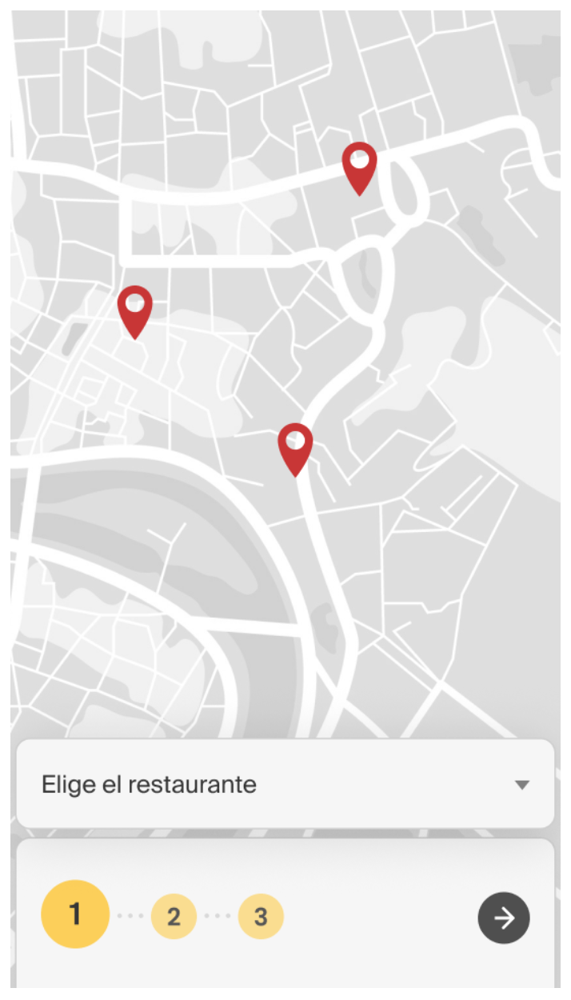
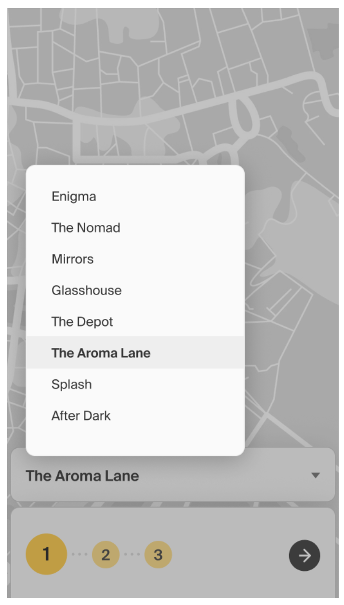
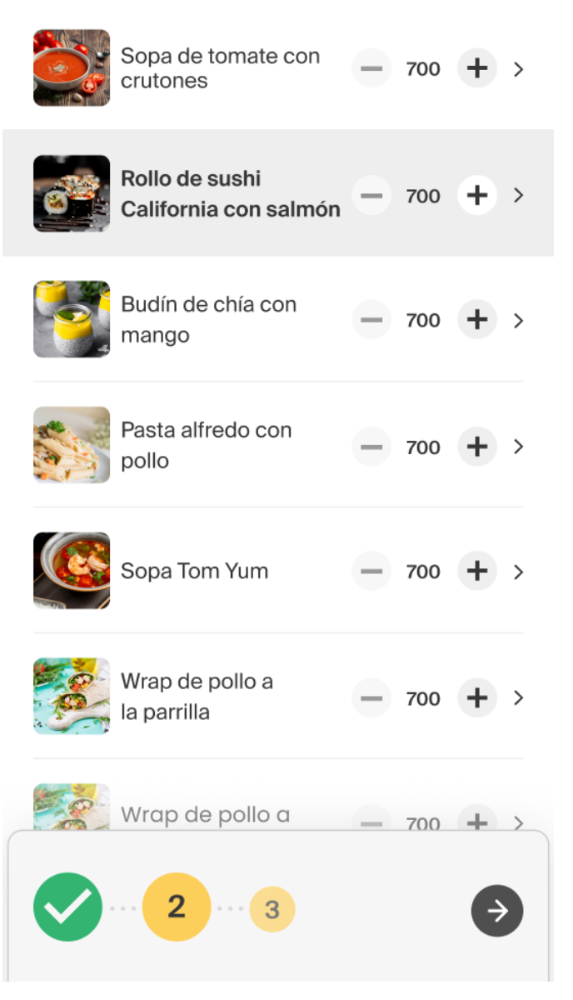
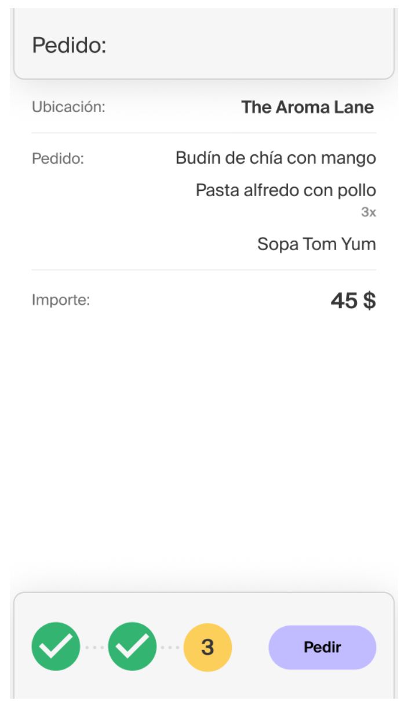
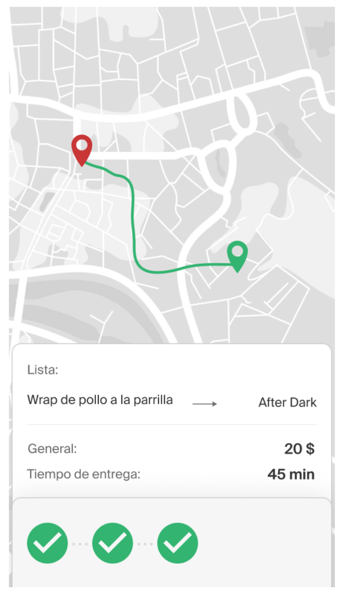

# APP_Testing_QAStudy

Urban Lunch en una aplicación similar a UberEats cuyo valor agregado es la capacidad de agrupar diversas ordenes de restaurantes.

Para este proyecto, desarrollé una lista de comprobación para todas las funcionalidades de la aplicación de acuerdo a los requerimientos establecidos por el cliente como la selección del punto de recogida, la elección de platos de diversos restaurantes, el seguimiento de la orden, entre otros.

* Para un mayor detalle sobre la lista de comprobación: https://docs.google.com/spreadsheets/d/12TwqQUPxVHJ2jW22KcNItrZNFESaDGyY/edit?usp=drive_link&ouid=113859848765718506189&rtpof=true&sd=true

* Para un mayor detalle de los requerimientos del aplicativo: https://github.com/carola02/Urban_Lunch_APP_Testing/blob/main/5Sprint_Requisitos_para_la_aplicacin_mvil_Urban_lunch.pdf

  
  
  
  
  

